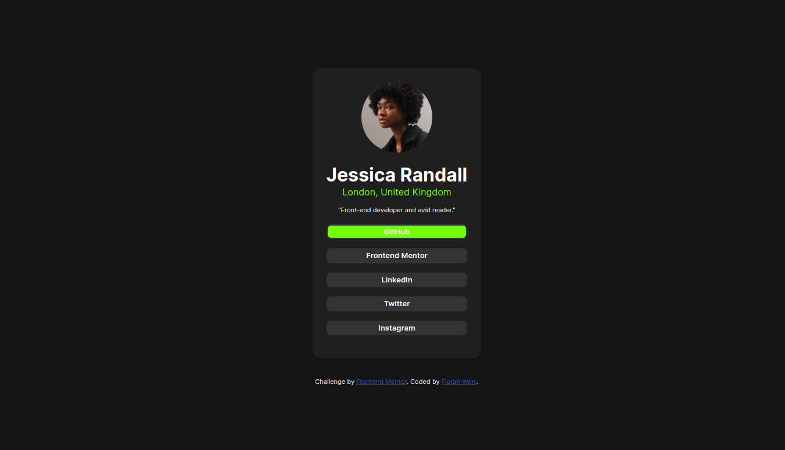
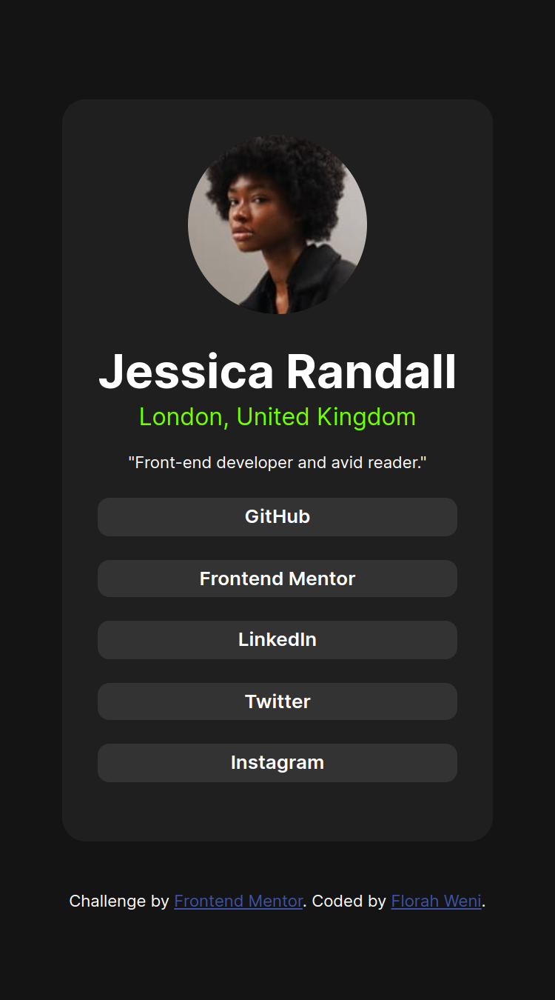

# Frontend Mentor - Social links profile solution

This is a solution to the [Social links profile challenge on Frontend Mentor](https://www.frontendmentor.io/challenges/social-links-profile-UG32l9m6dQ). Frontend Mentor challenges help you improve your coding skills by building realistic projects. 

## Table of contents

- [Overview](#overview)
  - [The challenge](#the-challenge)
  - [Screenshot](#screenshot)
  - [Links](#links)
- [My process](#my-process)
  - [Built with](#built-with)
  - [What I learned](#what-i-learned)
  - [Continued development](#continued-development)
  - [Useful resources](#useful-resources)
- [Author](#author)

## Overview

### The challenge

Users should be able to:

- See hover and focus states for all interactive elements on the page

### Screenshot





### Links


- Solution URL: [Github](https://github.com/FWeni/Social-links)
- Live Site URL: [Git pages](https://fweni.github.io/Social-links/)

## My process

### Built with

- Semantic HTML5 markup
- CSS custom properties
- Flexbox

### What I learned

I learnt to use javascript code to help me with page redirecting instead of using the <a> tag, which didn't work well for me when I tried implementing the design.

```html
<button type="submit" class="active" id="button-style">
        GitHub
</button>
```
```css
.proud-of-this-css {
#button-style.active {
    background-color: hsl(93, 100%, 50%);
}
```
```js
const redirection = document.getElementById('button-style');

function reroute() {
    window.location.href = '#';
}
```

### Continued development

I want to continue to add some functionality to the page using javascript. Perhaps applying something similar to my one portfolio site.

### Useful resources

- [w3schools](https://www.w3schools.com/howto) - This helped me with implemnting the active state of the desktop design. 


## Author

- Frontend Mentor - [@Fweni](https://www.frontendmentor.io/profile/Fweni)
